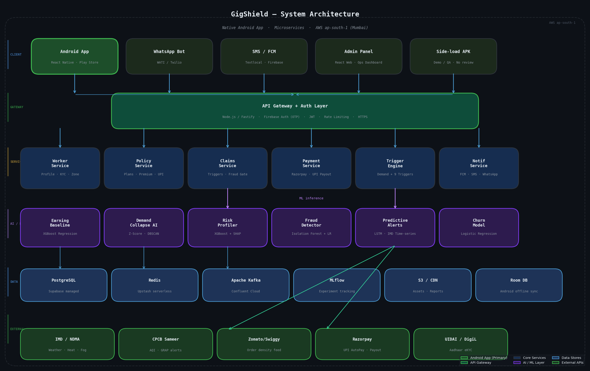

# GigShield
### *Opportunity Loss Protection for India's Gig Workforce*

> **"We don't pay because it rained. We pay because you couldn't earn."**

An AI-powered parametric insurance platform that automatically detects when external disruptions have caused a measurable drop in a food delivery worker's earning opportunity — and pays out instantly, with zero manual claims.

---

## Table of Contents

1. [The Problem](#the-problem)
2. [Our Solution — The Core Thesis](#our-solution)
3. [Know Your User — Personas](#know-your-user)
4. [Application Workflow](#application-workflow)
5. [Weekly Premium Model](#weekly-premium-model)
6. [Parametric Triggers](#parametric-triggers)
7. [Platform Choice — Native Android App](#platform-choice)
8. [AI / ML Integration](#aiml-integration)
9. [System Architecture](#system-architecture)
10. [Tech Stack](#tech-stack)
11. [Development Plan](#development-plan)
12. [Additional Innovations](#additional-innovations)
13. [Regulatory & Compliance](#regulatory--compliance)
14. [Success Metrics](#success-metrics)

---

## The Problem

India has **120 million+ gig workers**. Food delivery partners on Zomato and Swiggy are among the most exposed — their income is entirely dependent on being able to ride, and on being able to receive orders. When either condition breaks, they earn nothing.

External disruptions — extreme rain, heat waves, AQI lockdowns, platform outages, road blockades — cause delivery workers to lose **20–30% of their monthly income**. No warning. No compensation. No safety net of any kind.

The harder problem is that many of these disruptions are **invisible to official data sources**. A political rally blocking restaurant-access streets generates no government API alert. A platform going down for three hours on a Saturday evening has no NDMA notification. Workers lose hundreds of rupees and have no way to prove it, let alone claim it.

---

## Our Solution

**The GigShield Thesis:**

```
Expected Earnings  −  Actual Earnings  =  Opportunity Loss  →  Instant Payout
```

GigShield doesn't insure against weather. It insures against **income loss caused by disruptions**. The difference is fundamental:

- A conventional weather trigger pays if it rained. GigShield pays if the rain actually stopped the worker from earning.
- A platform outage trigger pays if Zomato was down during a worker's active session — not city-wide, not generically.
- A demand collapse trigger pays when order density in a worker's zone drops 50%+ below its four-week baseline — even if no official alert was ever issued.

Every payout is **automatic**. Workers receive money before they even realise they've been protected.

---

## Know Your User

### Primary Persona — Rajan Kumar, Zomato Delivery Partner, Bengaluru

Rajan is 28 years old, based in the Koramangala zone of Bengaluru — one of the city's densest restaurant clusters. He has been on Zomato for two years, completing 35 to 45 orders on a good weekday and earning between ₹18,000 and ₹22,000 a month. He rides a petrol two-wheeler and works two hard peaks every day: the lunch rush from noon to 2 PM and the dinner surge from 7 to 10 PM, when he earns almost two-thirds of his daily income. He owns a mid-range Android phone, has PhonePe set up, and has never had any form of insurance in his life.

When Bengaluru's monsoon rains flood Koramangala in July, or when a political rally blocks the arterial roads to the restaurant belt on a Friday evening, Rajan simply earns nothing. A two-day disruption costs him ₹2,400 to ₹3,600 — nearly a fifth of his monthly income — and there is currently no product in the market built for exactly this loss.

**What Rajan needs:** Something that works without him doing anything. He cannot file claims, call helplines, or upload receipts. If it rained and he couldn't work, money needs to appear in his wallet.

---

### Secondary Persona — Priya Devi, Swiggy Instamart Courier, Mumbai

Priya is 24, working out of the Andheri East dark store on Swiggy Instamart. She covers hyperlocal routes on a cycle and an e-scooter, completing 6 to 8 short-distance deliveries per hour during her peak window. Her income of ₹14,000 to ₹17,000 a month is lower than Rajan's, which makes every disrupted day proportionally more damaging. Mumbai's monsoon season is her biggest threat: when Andheri East roads are inundated, the zone's order flow collapses entirely — not just for her but for every rider simultaneously. GigShield's Demand Collapse AI is purpose-built for this pattern.

**What Priya needs:** Zone-level awareness, not city-level. She works a 2 km radius. When her zone collapses, she needs to be paid — even if the rest of Mumbai is fine.

---

### Scenario Walkthroughs

**Scenario A — Demand Collapse: Unofficial Road Blockade (Rajan, Friday 7 PM)**

A local political rally has blocked three arterial roads into Koramangala's restaurant belt. No Section 144, no government API alert. But inside GigShield's demand monitor, Rajan's zone — which normally sees 18–22 orders per hour on Friday evenings — has dropped to 3 per hour. By 7:22 PM, the Demand Collapse AI has confirmed an 83% drop sustained for over 90 minutes, corroborated by 8 other enrolled riders in the zone showing zero movement. Trigger fires. Rajan receives ₹520 for his estimated two lost peak hours — within 15 minutes, to his PhonePe wallet. No official alert was ever issued.

**Scenario B — Heavy Rainfall + Demand Validation (Rajan, Monday)**

IMD issues a Red Alert as rainfall crosses 65mm in three hours. GigShield's weather trigger fires — but doesn't pay on the alert alone. It simultaneously checks the demand monitor, which confirms a 75% drop in zone order density below the four-week baseline. Dual-validated payout of ₹450 released in 12 minutes. Fraud risk near-zero because external data and platform data are fully aligned.

**Scenario C — Platform Outage (Rajan, Saturday 8 PM)**

Zomato's order assignment service goes down. Rajan is logged in and waiting — no orders for 2.5 hours. GigShield detects the outage via Zomato's platform health API and DownDetector, corroborated by the demand monitor showing zero orders dispatched to any enrolled rider in the city. Payout: ₹380 for 2.5 lost peak hours, within 15 minutes.

**Scenario D — Extreme Heat + NDMA Advisory (Delhi Partner)**

Temperature reaches 46°C. NDMA bans outdoor commercial work 12–4 PM. Demand on the platform collapses as customers stop ordering. GigShield fires on both the temperature threshold (>44°C for 3 consecutive hours) and the demand confirmation (68% drop below Tuesday afternoon baseline). Worker receives ₹400 for the 4-hour protected window at 12:08 PM — 8 minutes after the heat threshold was confirmed.

---

## Application Workflow

### Onboarding (10 Steps, Under 5 Minutes)

```
1. Install          → Download GigShield from Play Store via QR code or SMS link
2. Phone OTP        → Mobile number verified via Firebase Auth
3. Platform Link    → Enter Zomato/Swiggy partner ID → 90-day history pulled via API
4. Earning Baseline → AI builds personalised hourly earning curve (background, ~2 min)
5. Zone Setup       → GPS captures working zones (up to 3); geofences set
6. Risk Profile     → XGBoost model generates Risk Score → personalised premium shown
7. Plan Selection   → Worker picks weekly tier (₹35 / ₹65 / ₹120) with plain breakdown
8. KYC Lite         → Aadhaar + selfie via DigiLocker eKYC — under 2 minutes
9. UPI AutoPay      → UPI Autopay mandate set — Monday 9 AM weekly debit (Razorpay)
10. Active!         → Policy activates instantly; push + SMS confirmation sent
```

### Weekly Policy Lifecycle

- Policy runs **Monday 00:00 → Sunday 23:59 IST**
- Premium debited Monday morning via UPI AutoPay (same day as Zomato/Swiggy settlement)
- Earning baseline refreshed every Monday from prior week's platform data
- Trigger monitors run **24/7** across all enrolled workers' zones
- **Sunday evening Weekly Summary** — hours covered, triggers fired, payouts received, next week's risk forecast
- **One-tap pause** for weeks off — no wasted premium, no cancellation friction

### Automated Claim & Payout Flow

```
Monitor   → Real-time polling every 10 min: trigger conditions + demand anomalies
Detect    → Threshold crossed — event logged with timestamp and zone ID
Validate  → Order density dropped ≥ 50% vs 4-week hourly baseline for 90+ min?
Verify    → GPS confirms worker was in affected zone in prior 30 min
Score     → Fraud model scores claim 0–1 (Isolation Forest + Logistic Regression)
Calculate → Payout = Avg hourly earnings × Disrupted hours (capped at daily max)
Approve   → Auto-approved if fraud score < 0.82 (~95% of claims); else 24-hr review
Pay       → UPI transfer via Razorpay Payout API — target < 15 minutes
Notify    → FCM push + SMS with plain-language payout summary
```

---

## Weekly Premium Model

### Why Weekly?

Zomato and Swiggy settle partner earnings every 5–7 days. A weekly premium cycle mirrors this cadence exactly — the debit happens on Monday morning, the same day settlement arrives. The worker never pays from savings.

Asking a gig worker to commit ₹500/month to an abstract insurance product fails. Asking them to commit ₹65 on the day their money arrives — for protection that activates immediately and can be paused any week they take off — is a fundamentally different proposition. Additional benefits: baselines refresh weekly so premiums always reflect current zone risk, and the weekly rhythm creates a natural engagement touchpoint (Sunday summary → Monday renewal).

### Plan Tiers

| Feature | Basic Shield | Plus Shield | Max Shield |
|---|---|---|---|
| **Weekly Premium** | **₹35** | **₹65** | **₹120** |
| Triggers covered | Rain (Red Alert only) | Rain + Heat + AQI + Flood | All 9 triggers |
| Demand Collapse AI | ✗ | Zone-level | Full + hourly baseline + peer corroboration |
| Platform Outage | ✗ | ✗ | ✓ |
| Max daily payout | ₹400 | ₹650 | ₹900 |
| Max weekly payout | ₹1,200 | ₹2,000 | ₹3,500 |
| Payout time target | < 30 min | < 20 min | < 10 min |
| Zone coverage | 1 zone | 2 zones | 3 zones + city-wide |
| Weekly summary | SMS only | SMS + App | SMS + App + WhatsApp PDF |

> **ROI check:** At ₹35/week (₹140/month), a single rain event causing 4 lost hours at ₹100/hr returns ₹400 — **2.9× the monthly premium**. The model targets a **68–75% combined ratio** — sustainable for the insurer, genuinely valuable for the worker.

### Dynamic Premium Multipliers

Base: **₹65/week** (Plus tier). SHAP values explain every adjustment in plain language on the worker's plan screen.

| Risk Factor | Adjustment |
|---|---|
| Flood-prone / coastal zone | +12% |
| Standard urban zone | 0% (baseline) |
| Peak-hour majority worker (7 PM–11 PM) | +8% |
| Claims > 3 in rolling 90 days | +15% |
| High demand-volatility zone (AI-assessed) | +10% |
| 500+ trips completed — experience discount | −10% |
| 13+ consecutive insured weeks — loyalty | −5% |
| Multi-platform worker (2+ apps linked) | −7% |
| No claims in prior 8 weeks — no-event bonus | −3% |

Maximum cap: **₹180/week** regardless of multipliers.

---

## Parametric Triggers

9 triggers. All grounded in objective third-party data. For triggers 1–7, the **Demand Collapse Validator runs as mandatory secondary confirmation** — both conditions must be true before payout releases. This dual-validation architecture brings the false-positive payout rate below 3%.

| # | Trigger | Threshold | Data Source |
|---|---|---|---|
| 1 | Heavy Rainfall | Rainfall > 60mm/3hr **or** IMD Red Alert active | IMD API + OpenWeatherMap |
| 2 | Extreme Heat | Temp > 44°C for 3+ hrs + NDMA advisory | IMD + NDMA API |
| 3 | Severe Pollution | AQI > 400 (CPCB) + GRAP Stage 3 or 4 | CPCB Sameer API |
| 4 | Flooding | NDRF Level 3+ **or** hyperlocal waterlogging confirmed | NDRF alert feed |
| 5 | Cyclone | IMD Cyclone Warning for worker's coastal district | IMD tropical tracker |
| 6 | Curfew / Bandh | Section 144 **or** verified bandh for zone | State govt API + news scraper |
| 7 | Dense Fog | Visibility < 50m for 2+ hrs + IMD Dense Fog Advisory | IMD fog advisory |
| **8** | **Demand Collapse AI** | **Order density drops ≥ 50% below 4-week hourly baseline for 90+ min** | **Platform order-density feed + Z-Score / DBSCAN model** |
| **9** | **Platform Outage** | **Zomato/Swiggy confirmed down > 2 hrs during active session** | **Platform status APIs + DownDetector + peer corroboration** |

> **Triggers 8 and 9 are GigShield's original contributions.** Trigger 8 catches every disruption that official APIs miss — unofficial rallies, unmarked road closures, sudden zone blackouts — by monitoring what actually matters: are orders flowing to this worker right now? Trigger 9 addresses a uniquely digital risk that no existing product covers: a worker whose 100% of income depends on an app staying online.

---

## Platform Choice

### Native Android App — React Native → Google Play Store

GigShield ships as a **native Android application**. This is the correct architecture for a financial product targeting delivery workers — not a compromise or a later upgrade plan.

| Capability | Why Native Android Wins |
|---|---|
| **Background GPS** | Persistent OS-level location — continuous zone validation across a full shift, not just at polling intervals. Critical for zone-verified payouts. |
| **Push Notifications** | FCM native delivery — reliable even when screen is locked, app is closed, or data is intermittent. Payout alerts must arrive. |
| **Play Store Trust** | Verified publisher badge, star ratings, review history — essential when asking workers to link their UPI wallet to an unknown product. |
| **UPI Intent API** | Native Android UPI Intent flow — smoother mandate setup, measurably fewer drop-offs at the critical onboarding step 9. |
| **Biometric Auth** | Fingerprint / face unlock for payout confirmation — production-grade security from day one. |
| **Auto-Updates** | Play Store silent background updates — critical as trigger logic and payout rules evolve post-launch without users taking action. |
| **Offline Sync** | Room DB (SQLite) — policy status and payout history readable in zero-connectivity delivery zones. |

**On Play Store review time:** For the hackathon, the APK is side-loaded directly onto demo devices — no review delay. For production, the review runs in parallel with QA and insurer partnership finalization. Google's fast-track fintech review path reduces approval to 3–5 days.

**Why not PWA:** PWA Service Workers are throttled by Android's battery optimiser on sub-₹10,000 phones — which 80%+ of delivery workers use. Background GPS is unreliable. Push notifications are inconsistent on the exact device profile that matters most.

**Permanent companion channels (not fallbacks):**
- **WhatsApp Bot (WATI)** — full onboarding, policy status, payout alerts via chat; zero install, zero storage
- **SMS** — one-way payout confirmations and weekly summaries for workers without active data

> 95%+ of Zomato/Swiggy delivery partners use Android. iOS is out of scope for v1.

---

## AI/ML Integration

### Layer 1 — Earning Baseline Engine *(Foundation of Opportunity Loss)*

Every payout is calculated against a personalised earning baseline — not a flat rate. Rajan earns ₹95/hr on Friday evenings in Koramangala. He earns ₹40/hr on Tuesday middays. GigShield knows the difference and pays accordingly.

- **Input:** 90-day platform delivery history — orders, timestamps, zone, order type, day of week
- **Model:** XGBoost Regression on structured tabular delivery data
- **Output:** Per-worker hourly earning curve — used by Demand Collapse trigger, payout calculator, and premium risk engine
- **Refresh:** Every Monday, recalibrated against the prior week's actuals
- **Explainability:** SHAP values power a "Why this payout amount?" screen for every worker

### Layer 2 — Demand Collapse Detector *(Core Differentiator)*

Detects earning collapses caused by disruptions with no official API — the strongest novelty of GigShield.

- Every **10 minutes:** compares current orders/hour in each enrolled zone against the 4-week rolling hourly baseline for that exact zone × time-of-day slot
- **Trigger condition:** ≥ 50% drop sustained for ≥ 90 minutes
- **Peer corroboration (DBSCAN):** If 3+ enrolled workers in the same zone simultaneously show zero order activity → confidence elevates to HIGH → payout enabled without any external API firing
- **Model:** Z-score anomaly on rolling time-series + DBSCAN spatial clustering
- Requires **zero government APIs** — derived entirely from platform order behaviour

### Layer 3 — Dynamic Risk Profiling Engine

Generates a personalised Risk Score (0–100) at onboarding and refreshes weekly to drive each worker's premium multiplier.

- **Input:** Zone flood maps (NDRF), 3-year IMD weather frequency, historical platform outage records, working hour patterns, city AQI trend, peer claim frequency
- **Model:** XGBoost Classifier
- **Output:** Risk Score → premium multiplier, explained via SHAP values on the plan screen

### Layer 4 — Fraud Detection Ensemble

Scores every auto-triggered claim before payout. ~95% pass automatically; ~5% go to a 24-hour human review queue.

- **Model:** Isolation Forest (anomaly detection) + Logistic Regression (binary classifier) ensemble
- **Features:** GPS vs declared zone at trigger time, time since last claim, claim frequency vs 90-day history, device fingerprint consistency, peer social proof (are other enrolled workers also showing zero activity in the same zone?)
- **Threshold:** Fraud probability > 0.82 → flagged for review; < 0.82 → auto-approved
- **Target:** F1 score > 0.88 on holdout test set

### Layer 5 — Predictive Risk Alerts *(48-Hour Forward Model)*

Gives workers advance notice of likely disruption events so they can plan.

- **Model:** LSTM on IMD time-series weather data per city, retrained monthly
- If tomorrow's probability of a Red Alert or heat event > 60% → proactive push + WhatsApp notification
- Example: *"High rain risk in your zone tomorrow (7–10 PM). Your Plus Shield covers you for up to ₹650."*

### Layer 6 — Churn & Re-engagement Prediction

Identifies workers at risk of cancelling before a disruption event reminds them why they need protection.

- **Model:** Logistic Regression on behavioural engagement signals
- Triggers personalised retention nudges with zone-specific forward risk data — not generic "don't cancel" messages

---

## System Architecture



7 independent microservices on **AWS Mumbai (ap-south-1)**. Every service is stateless and horizontally scalable. The Trigger Engine has an independent **99.9% uptime SLA**. Kafka guarantees no trigger event is ever lost even if downstream services are temporarily unavailable.

| Service | Responsibility |
|---|---|
| **Trigger Engine** | Polls 9 trigger APIs every 10 min; runs Demand Collapse detector; publishes to Kafka `trigger.events` |
| **Policy Service** | Policy lifecycle, weekly renewals, premium calculation (via ML service), UPI AutoPay mandate management |
| **Claims Service** | Subscribes to `trigger.events`; fraud score gate; payout calculation; publishes to `payment.queue` |
| **Worker Service** | Profiles, KYC, zone registration, earning baseline storage, platform link management |
| **Payment Service** | Razorpay abstraction — UPI AutoPay debits (Monday) + instant payouts (on-demand) |
| **Notification Service** | FCM push + SMS (Textlocal) + WhatsApp (WATI) — event-driven from all services |
| **Analytics Service** | Claim events, payout volumes, trigger frequencies, loss ratios — powers the ops dashboard |

---

## Tech Stack

| Layer | Technology | Why |
|---|---|---|
| **Android App** | React Native | ~80% shared code with admin panel; native OS APIs (GPS, biometric, UPI Intent) |
| **Admin Panel** | React.js + Tailwind | Web ops dashboard for the GigShield team |
| **Backend API** | Node.js + Fastify | High async I/O for webhook-heavy trigger flows |
| **AI/ML Service** | Python FastAPI + ONNX | Isolated, scalable, < 50ms inference per claim |
| **Demand Monitor** | Python + Kafka consumer + Redis time-series | Real-time Z-score anomaly at zone level, every 10 min |
| **Primary DB** | PostgreSQL (Supabase managed) | ACID compliance for policy and claims records |
| **Cache** | Redis (Upstash serverless) | Sub-ms feature lookups; rate limiting; session state |
| **Event Streaming** | Apache Kafka (Confluent Cloud) | Guaranteed delivery — no payout ever lost to service downtime |
| **Auth** | Firebase Auth (phone OTP) | Most reliable OTP delivery in India |
| **KYC** | DigiLocker + UIDAI Aadhaar eKYC | Paperless, instant; hash-only storage (never raw Aadhaar) |
| **Payments** | Razorpay (UPI AutoPay + Payout API) | Best UPI AutoPay coverage + instant payout support in India |
| **Weather** | OpenWeatherMap + IMD XML feed | Free tier + official Indian government data |
| **AQI** | CPCB Sameer API | Official India AQI at sub-district resolution |
| **Platform Status** | Custom scraper + DownDetector API | Real-time Zomato/Swiggy outage detection |
| **Maps / Zones** | Google Maps Platform | Zone boundary definition + geofence management |
| **Cloud** | AWS Mumbai (EC2, RDS, S3, SQS) | Data sovereignty; lowest latency for Indian users |
| **ML Training** | scikit-learn, XGBoost, TensorFlow/Keras | Isolation Forest, XGBoost Regression/Classifier, LSTM |
| **MLOps** | MLflow + GitHub Actions | Experiment tracking + weekly automated retraining |
| **Explainability** | SHAP | "Why this premium?" and "Why this payout?" screens |
| **Android Offline** | Room DB (SQLite) | Policy status readable without connectivity |
| **CI/CD** | GitHub Actions + Docker + AWS ECS | Automated test → build → deploy |
| **Monitoring** | Grafana + Prometheus + Sentry | Real-time ops + error tracking |
| **WhatsApp** | WATI / Twilio WhatsApp Business API | Zero-install access channel for low-storage workers |

---

## Development Plan

| Phase | Timeline | Key Deliverables |
|---|---|---|
| **0 — Foundation** | Week 1 | Monorepo, CI/CD, PostgreSQL schema, API contracts, Figma system, Kafka local dev |
| **1 — Core Backend** | Weeks 2–3 | Worker service (auth, KYC, profile), Policy service (plans, premium), Razorpay UPI AutoPay |
| **2 — Trigger Engine** | Weeks 3–4 | Weather/AQI/NDMA integrations, Kafka streaming, triggers 1–7, platform outage detector |
| **3 — Demand Collapse AI** | Week 4 | Order-density feed (simulated), 4-week baseline model, Z-score detector, DBSCAN peer-corroboration |
| **4 — ML Services** | Week 5 | Earning Baseline (XGBoost), Risk Profiler, Fraud ensemble, FastAPI + ONNX deployed |
| **5 — Claims & Payouts** | Week 5 | Auto-claim creation, fraud gate, Razorpay Payout API, dual-channel notifications |
| **6 — Android App** | Weeks 5–6 | React Native screens (onboarding, dashboard, payout history, zone map, weekly summary), background GPS, biometric auth, WhatsApp bot, admin ops dashboard |
| **7 — Testing & QA** | Week 7 | Device testing (5 Android models, 2–6 GB RAM), all 9 triggers simulated, load test 10K concurrent, fraud F1 > 0.88, Demand Collapse precision backtest |
| **8 — Play Store Prep** | Weeks 7–8 | Store listing, screenshots, privacy policy, IRDAI sandbox docs, submit for review |
| **9 — Hackathon Demo** | Week 8 | Side-loaded APK, 3 scripted persona scenarios (Rajan: rain event + demand collapse + platform outage), seeded realistic data, analytics dashboard live |

---

## Additional Innovations

**Zone-Level Micro-Mapping** — Disruptions mapped at the delivery zone level, not city-wide. Koramangala and Whitefield can have completely different rainfall. Only workers in the affected zone are paid. More precise, harder to game.

**Peer Validation Network** — When 3+ enrolled workers in the same zone simultaneously show zero order activity for 90+ minutes, trigger confidence elevates to HIGH without any external API. Catches unofficial blockades and events that no government feed covers.

**Shield Stars Loyalty Programme** — Workers maintaining 12+ consecutive insured weeks without fraudulent activity earn Shield Stars, redeemable for premium discounts, Indian Oil fuel vouchers, or Zomato dining credits.

**Sunday Weekly Income Shield Report** — Personalised weekly summary via app and WhatsApp: hours worked vs disrupted, triggers fired, total payouts, next week's risk forecast, anonymised zone earnings comparison. Transforms GigShield from a passive product into a weekly financial companion.

---

## Regulatory & Compliance

- **IRDAI InsurTech Sandbox** — prototype stage; no traditional insurance licence required
- **Production path** — partner with licensed general insurer (Bajaj Allianz / HDFC ERGO) as risk carrier; GigShield operates as technology platform and MGA
- **UPI AutoPay** — follows RBI NACH / e-mandate guidelines; OTP-confirmed consent built into onboarding step 9
- **Aadhaar eKYC** — hash-only storage per UIDAI API guidelines; raw Aadhaar number never persisted
- **DPDP Act 2023** — data minimisation, explicit consent, right to erasure, no third-party data sale
- **Platform data** — order-density data used in aggregated anonymised form only; no individual transaction data stored beyond 90-day sliding window

---

## Success Metrics

| KPI | Target (6 months post-launch) |
|---|---|
| Onboarding completion rate | > 72% of installs complete full flow |
| Weekly policy renewal rate | > 85% auto-renewal retention |
| Demand Collapse trigger precision | > 90% on backtested historical events |
| Trigger detection → payout initiation | < 15 minutes from threshold breach |
| End-to-end payout time | < 15 minutes from confirmation to UPI credit |
| Fraud detection F1 score | > 0.88 on holdout test set |
| Claims loss ratio | 65–75% — sustainable combined ratio |
| False positive payout rate | < 3% (dual-validation architecture) |
| Worker NPS | > 55 (vs BFSI digital product benchmark) |
| Trigger Engine uptime | > 99.5% independent SLA |
| WhatsApp bot containment | > 60% queries resolved without escalation |

---

## Repository Structure

```
gigshield/
├── apps/
│   ├── android/              # React Native Android app
│   └── admin/                # React web ops dashboard
├── services/
│   ├── trigger-engine/       # Trigger polling + Demand Collapse detector
│   ├── policy-service/       # Policy lifecycle + premium calculation
│   ├── claims-service/       # Claim creation + fraud gate + payout
│   ├── worker-service/       # Profiles, KYC, zones, platform links
│   ├── payment-service/      # Razorpay UPI AutoPay + Payout
│   ├── notification-service/ # FCM + SMS + WhatsApp dispatch
│   └── analytics-service/    # Ops dashboard + loss ratio engine
├── ml/
│   ├── earning-baseline/     # XGBoost earning curve model
│   ├── demand-collapse/      # Z-score + DBSCAN anomaly detector
│   ├── risk-profiler/        # XGBoost risk scoring + SHAP
│   ├── fraud-detector/       # Isolation Forest + LR ensemble
│   ├── predictive-alerts/    # LSTM weather forecast model
│   └── churn-model/          # Logistic regression engagement model
├── infra/
│   ├── docker/               # Compose files for local dev
│   ├── k8s/                  # Kubernetes deployment manifests
│   └── terraform/            # AWS infrastructure as code
├── docs/
│   ├── arch_readme.png       # System architecture diagram
│   └── api-contracts/        # OpenAPI specs for all services
└── README.md
```

---

<div align="center">

**GigShield — Protect the Hustle.**

*Expected Earnings − Actual Earnings = The Protection Gap We Fill.*

</div>
